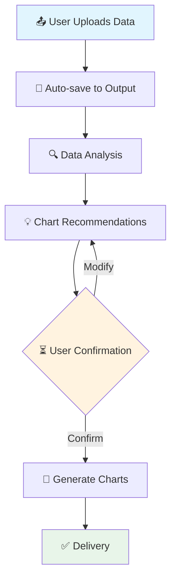

<div align="center">


# 📊 PyThesisPlot

**Professional Scientific Plotting for Academic Publications**

*From Data to Publication-Ready Figures in Minutes*

[🚀 Quick Start](#quick-start) • [📖 Documentation](#documentation) • [💡 Examples](#examples) • [📝 Release Notes](https://github.com/stephenlzc/pythesis-plot/releases) • [🌐 中文](README.zh-CN.md)

</div>

---

## ✨ Features

<table>
<tr>
<td width="50%">

### 🎯 **Workflow-Driven**
- **Data Upload** → **Analysis** → **Recommendations** → **Confirmation** → **Generation**
- Smart data analysis with automatic chart recommendations
- User confirmation required before generation

### 📁 **Organized Output**
```
output/
└── 20250312-143052-data/
    ├── 20250312-143052-data.csv
    ├── analysis_report.md
    ├── plot_config.json
    ├── 20250312-143052_plot.py
    └── *.png (300 DPI)
```

</td>
<td width="50%">

### 🎨 **Publication-Ready**
- 300 DPI high-resolution PNG output
- Nature/Science/Lancet style compliance
- Automatic statistical annotations (* / ** / ***)
- Professional color palettes (colorblind-friendly)

### 🔬 **Multi-Domain Support**
- 🧬 Biology & Medicine (qPCR, Western Blot, Cell assays)
- 📈 Psychology & Social Sciences (Survey data, RCT studies)
- 📊 Economics & Business (Time series, Comparisons)
- 🧪 Chemistry & Materials (Spectroscopy, Measurements)

</td>
</tr>
</table>

---

## 🚀 Quick Start

### Installation

```bash
# Clone the skill
git clone https://github.com/stephenlzc/pythesis-plot.git
cd pythesis-plot

# Install dependencies
pip install pandas matplotlib seaborn openpyxl numpy scipy
```

### Basic Usage

#### Option 1: Complete Workflow (Recommended)

```bash
python scripts/workflow.py --input your_data.csv
```

This will:
1. 📁 Create organized output directory
2. 🔍 Analyze your data automatically
3. 💡 Recommend chart schemes
4. ⏳ Wait for your confirmation
5. 🎨 Generate publication-ready figures

#### Option 2: Analysis Only

```bash
python scripts/data_analyzer.py --input your_data.csv
```

#### Option 3: Generate from Config

```bash
python scripts/plot_generator.py --config plot_config.json
```

---

## 📖 Documentation

### 📋 Table of Contents

- [Workflow Guide](references/workflow_guide.md) - Complete workflow walkthrough
- [Chart Types](references/chart_types.md) - Available chart types and when to use them
- [Style Guide](references/style_guide.md) - Color schemes, fonts, and layout standards
- [Examples](references/examples.md) - Code examples for common scenarios

### 🎨 Supported Chart Types

| Chart Type | Best For | Example |
|:----------:|:---------|:--------|
| 📈 Line Plot | Time series, Trends | Gene expression over time |
| 📊 Bar Chart | Group comparisons | Treatment vs Control |
| 🎯 Box Plot | Distribution, Outliers | qPCR Ct values |
| ⚡ Scatter + Regression | Correlations | Dose-response relationships |
| 🔥 Heatmap | Correlation matrices | Multi-gene expression |
| 📋 Dashboard | Multi-panel figures | Complete study overview |

---

## 💡 Examples

### Example 1: PCOS Study (Biomedical)

**Data**: Mouse PCOS model with BRAC1 gene expression (108 samples, 3 groups)

**Generated Figures**:
- Body weight comparison with significance markers
- Ovary weight analysis
- BRAC1 relative expression (log scale)
- qPCR Ct value distributions
- **Comprehensive 2×2 dashboard**

**Key Finding**: BRAC1 expression downregulated 55× in PCOS model (p<0.001)

```bash
python scripts/workflow.py --input Mouse_PCOS_BRAC1_RawData_108.xlsx
```

### Example 2: Mental Health RCT (Psychology)

**Data**: Adolescent mental health intervention (1200 participants, 4 groups)

**Generated Figures**:
- CONSORT-style study overview
- SDQ pre/post comparison
- Responder analysis (0.3% → 61.3%)
- Dose-response relationship
- **6-panel comprehensive dashboard**

**Key Finding**: Combined CBT+Mindfulness intervention achieved 61.3% response rate

```bash
python scripts/workflow.py --input Adolescent_Mental_Health_Intervention_1200.xlsx
```

---

## 🏗️ Architecture

```
pythesis-plot/
├── 📄 SKILL.md                      # Skill definition
├── 📁 scripts/
│   ├── 🔄 workflow.py               # Main workflow orchestrator
│   ├── 🔍 data_analyzer.py          # Data analysis engine
│   └── 🎨 plot_generator.py         # Chart generation engine
├── 📁 references/
│   ├── 📖 workflow_guide.md         # Workflow documentation
│   ├── 📊 chart_types.md            # Chart type guide
│   ├── 🎨 style_guide.md            # Visual style standards
│   └── 💻 examples.md               # Code examples
├── 📁 assets/themes/
│   ├── 🎓 academic.mplstyle         # Academic style theme
│   ├── 🔬 nature.mplstyle           # Nature journal style
│   └── 📊 presentation.mplstyle     # Presentation style
└── 📁 output/                       # Generated outputs
```

---

## 🎯 Workflow Stages



### Stage 1: Data Reception 📤
- Automatic file renaming with timestamp
- Organized directory creation
- Support for CSV, Excel, TXT, Markdown

### Stage 2: Data Analysis 🔍
- Automatic dimension detection
- Column type identification (numeric/categorical/datetime)
- Statistical summary generation
- Relationship analysis

### Stage 3: Chart Recommendations 💡
- AI-powered chart type suggestions
- Layout recommendations
- Statistical test suggestions

### Stage 4: User Confirmation ⏳
- **CRITICAL**: Must wait for explicit confirmation
- Interactive modification support
- Preview recommendations

### Stage 5: Generation & Delivery ✅
- High-resolution PNG generation (300 DPI)
- Reproducible Python code output
- Organized file management

---

## 📦 Dependencies

```toml
[dependencies]
python = ">=3.8"
pandas = ">=1.3.0"
matplotlib = ">=3.5.0"
seaborn = ">=0.11.0"
openpyxl = ">=3.0.0"  # Excel support
numpy = ">=1.20.0"
scipy = ">=1.7.0"
```

---

## 🤝 Contributing

Contributions are welcome! Please feel free to submit a Pull Request.

1. Fork the repository
2. Create your feature branch (`git checkout -b feature/AmazingFeature`)
3. Commit your changes (`git commit -m 'Add some AmazingFeature'`)
4. Push to the branch (`git push origin feature/AmazingFeature`)
5. Open a Pull Request

---

## 📄 License

This project is licensed under the MIT License - see the [LICENSE](LICENSE) file for details.

---

## 🙏 Acknowledgments

- 🎨 Color palettes inspired by [Nature](https://www.nature.com/) and [Science](https://www.science.org/) style guides
- 📊 Statistical visualization best practices from [Seaborn](https://seaborn.pydata.org/)
- 🎓 Academic plotting standards from [Matplotlib](https://matplotlib.org/)

---

<div align="center">

**Made with ❤️ for Researchers**

[⬆ Back to Top](#-pythesisplot)

---

🌐 **Languages**: [English](README.md) | [中文](README.zh-CN.md)

</div>
