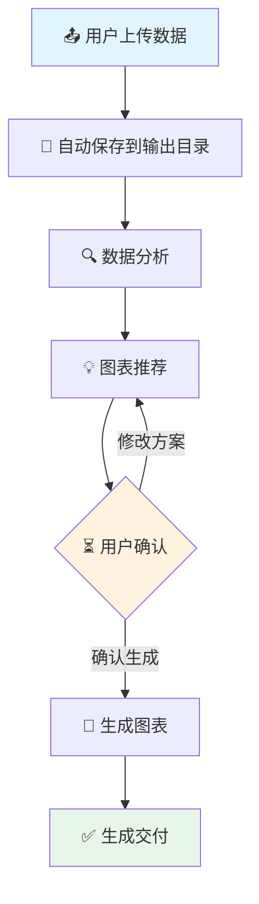

<div align="center">


# 📊 PyThesisPlot

**专业科研作图工具，助力学术发表**

*从数据到顶刊级图表，只需几分钟*

[🚀 快速开始](#快速开始) • [📖 文档](#文档) • [💡 示例](#示例) • [🌐 English](README.md)

</div>

---

## ✨ 功能特色

<table>
<tr>
<td width="50%">

### 🎯 **工作流驱动**
- **数据上传** → **分析** → **推荐** → **确认** → **生成**
- 智能数据分析，自动推荐图表方案
- 生成前必须经用户确认

### 📁 **规范输出**
```
output/
└── 20250312-143052-data/
    ├── 20250312-143052-data.csv     # 原始数据
    ├── analysis_report.md           # 分析报告
    ├── plot_config.json             # 图表配置
    ├── 20250312-143052_plot.py      # Python代码
    └── *.png (300 DPI)              # 高清图表
```

</td>
<td width="50%">

### 🎨 **顶刊品质**
- 300 DPI 高分辨率 PNG 输出
- 符合 Nature/Science/Lancet 期刊标准
- 自动统计显著性标注 (* / ** / ***)
- 专业配色方案（色盲友好）

### 🔬 **多领域支持**
- 🧬 生物医学（qPCR、Western Blot、细胞实验）
- 📈 心理学与社会科学（问卷调查、RCT研究）
- 📊 经济与商科（时间序列、对比分析）
- 🧪 化学与材料（光谱、测量数据）

</td>
</tr>
</table>

---

## 🚀 快速开始

### 安装

```bash
# 克隆项目
git clone <repository-url>
cd pythesis-plot

# 安装依赖
pip install pandas matplotlib seaborn openpyxl numpy scipy
```

### 基本用法

#### 方式一：完整工作流（推荐）

```bash
python scripts/workflow.py --input your_data.csv
```

执行流程：
1. 📁 创建规范化的输出目录
2. 🔍 自动分析数据特征
3. 💡 智能推荐图表方案
4. ⏳ 等待您的确认
5. 🎨 生成顶刊级图表

#### 方式二：仅数据分析

```bash
python scripts/data_analyzer.py --input your_data.csv
```

#### 方式三：根据配置生成

```bash
python scripts/plot_generator.py --config plot_config.json
```

---

## 📖 文档

### 📋 目录

- [工作流程详解](references/workflow_guide.md) - 完整工作流说明
- [图表类型指南](references/chart_types.md) - 支持的图表类型及使用场景
- [样式规范](references/style_guide.md) - 配色、字体、布局标准
- [代码示例](references/examples.md) - 常见场景代码示例

### 🎨 支持的图表类型

| 图表类型 | 适用场景 | 示例 |
|:----------:|:---------|:--------|
| 📈 折线图 | 时间序列、趋势展示 | 基因表达随时间变化 |
| 📊 柱状图 | 分组对比 | 治疗组 vs 对照组 |
| 🎯 箱线图 | 分布、异常值 | qPCR Ct值分布 |
| ⚡ 散点+回归 | 相关性分析 | 剂量-效应关系 |
| 🔥 热力图 | 相关性矩阵 | 多基因表达相关性 |
| 📋 仪表盘 | 多子图组合 | 研究全貌展示 |

---

## 💡 示例

### 示例 1：PCOS 研究（生物医学）

**数据**：小鼠PCOS模型，BRAC1基因表达（108样本，3组）

**生成图表**：
- 体重对比（含显著性标记）
- 卵巢重量分析
- BRAC1相对表达量（对数刻度）
- qPCR Ct值分布
- **2×2综合仪表盘**

**核心发现**：PCOS模型组BRAC1表达下调55倍（p<0.001）

```bash
python scripts/workflow.py --input Mouse_PCOS_BRAC1_RawData_108.xlsx
```

### 示例 2：青少年心理健康 RCT（心理学）

**数据**：青少年心理健康干预研究（1200参与者，4组）

**生成图表**：
- CONSORT风格研究概况
- SDQ干预前后对比
- 响应者分析（0.3% → 61.3%）
- 剂量-效应关系
- **6图综合仪表盘**

**核心发现**：CBT+正念联合干预响应率达61.3%

```bash
python scripts/workflow.py --input Adolescent_Mental_Health_Intervention_1200.xlsx
```

---

## 🏗️ 项目结构

```
pythesis-plot/
├── 📄 SKILL.md                      # Skill 定义文件
├── 📁 scripts/
│   ├── 🔄 workflow.py               # 主工作流脚本
│   ├── 🔍 data_analyzer.py          # 数据分析引擎
│   └── 🎨 plot_generator.py         # 图表生成引擎
├── 📁 references/
│   ├── 📖 workflow_guide.md         # 工作流文档
│   ├── 📊 chart_types.md            # 图表类型指南
│   ├── 🎨 style_guide.md            # 视觉样式规范
│   └── 💻 examples.md               # 代码示例
├── 📁 assets/themes/
│   ├── 🎓 academic.mplstyle         # 学术风格主题
│   ├── 🔬 nature.mplstyle           # Nature期刊风格
│   └── 📊 presentation.mplstyle     # 演示汇报风格
└── 📁 output/                       # 输出目录
```

---

## 🎯 工作流阶段



### 阶段 1：数据接收 📤
- 自动时间戳重命名
- 创建规范化目录
- 支持 CSV、Excel、TXT、Markdown

### 阶段 2：数据分析 🔍
- 自动识别数据维度
- 列类型识别（数值/分类/时间）
- 生成统计摘要
- 列间关系分析

### 阶段 3：图表推荐 💡
- AI 智能推荐图表类型
- 布局方案建议
- 统计检验建议

### 阶段 4：用户确认 ⏳
- **关键步骤**：必须等待明确确认
- 支持交互式修改
- 预览推荐方案

### 阶段 5：生成交付 ✅
- 高分辨率 PNG 生成（300 DPI）
- 可复现的 Python 代码
- 统一的文件管理

---

## 📦 依赖要求

```toml
[dependencies]
python = ">=3.8"
pandas = ">=1.3.0"
matplotlib = ">=3.5.0"
seaborn = ">=0.11.0"
openpyxl = ">=3.0.0"  # Excel 支持
numpy = ">=1.20.0"
scipy = ">=1.7.0"
```

---

## 🤝 贡献指南

欢迎提交 Pull Request！

1. Fork 本仓库
2. 创建特性分支 (`git checkout -b feature/AmazingFeature`)
3. 提交更改 (`git commit -m 'Add some AmazingFeature'`)
4. 推送到分支 (`git push origin feature/AmazingFeature`)
5. 打开 Pull Request

---

## 📄 开源协议

本项目采用 MIT 协议 - 详见 [LICENSE](LICENSE) 文件

---

## 🙏 致谢

- 🎨 配色方案参考 [Nature](https://www.nature.com/) 和 [Science](https://www.science.org/) 风格指南
- 📊 统计可视化最佳实践来自 [Seaborn](https://seaborn.pydata.org/)
- 🎓 学术作图标准参考 [Matplotlib](https://matplotlib.org/)

---

<div align="center">

**用 ❤️ 为科研工作者打造**

[⬆ 返回顶部](#-pythesisplot)

---

🌐 **多语言**: [English](README.md) | [中文](README.zh-CN.md)

</div>
